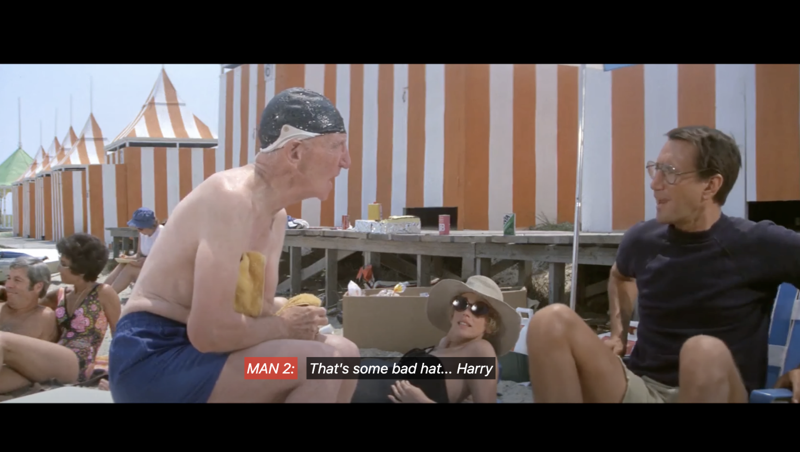
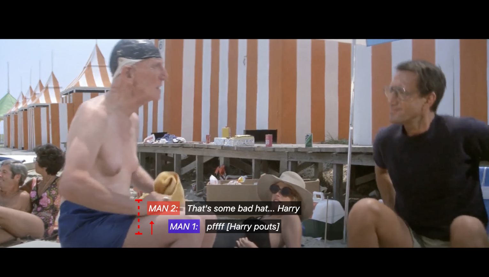
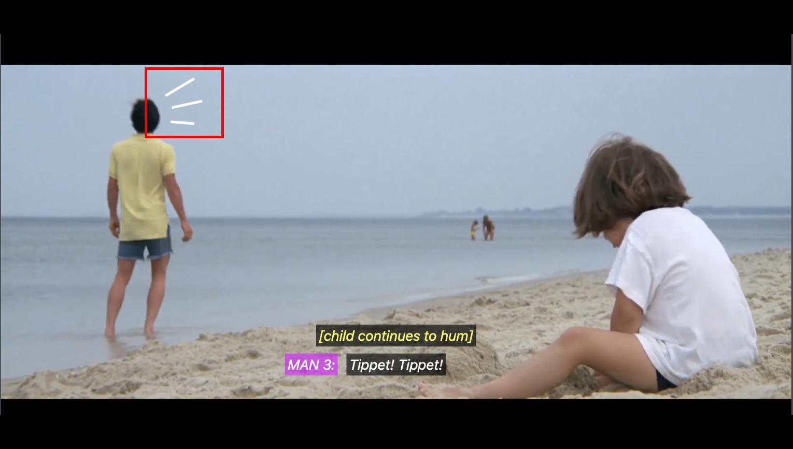
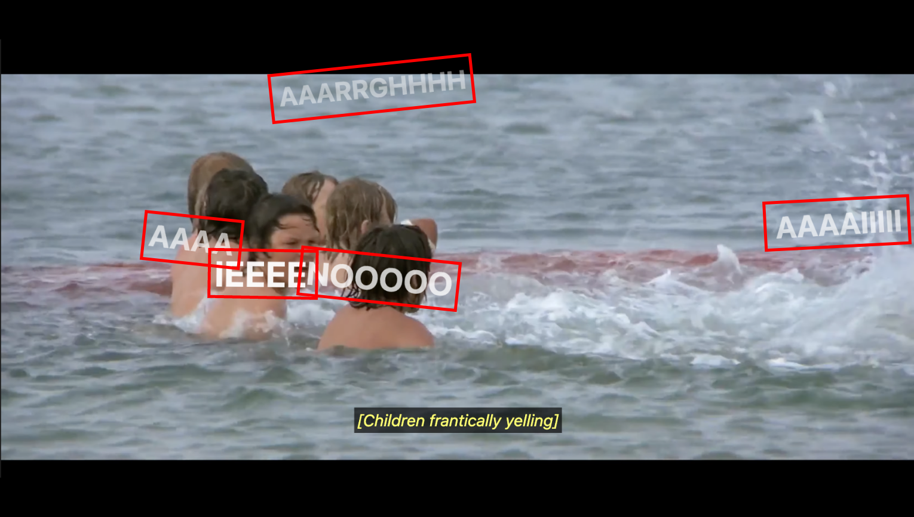
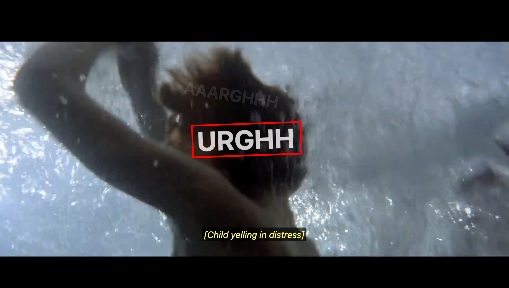

# Human Centered Design <br> David Bijl

<br>
<br>
<br>

> ## Week 1
> **<sub><sup>31 mar t/m 4 apr</sup></sub>**

**Opdracht omschrijving:** <br>
Darice wil graag de inhoud van podcasts kunnen volgen, inclusief alle hoorbare details zoals sfeergeluiden, geluidseffecten en nuances zoals intonatie en andere stemkenmerken. Klinkt iemand bijvoorbeeld boos? Verdrietig? Vrolijk?


<br>
<br>

Voordat ik begon met coderen, wilde ik eerst onderzoek doen naar de beste manieren om audio te vertalen naar beeld. De meest voor de hand liggende oplossing is om audio om te zetten in tekst… en klaar. Maar tekst mist vaak de emotie en nuance die geluid juist overbrengt. Daarom leek het me een goed idee om op zoek te gaan naar bronnen die dit specifieke probleem onderzoeken en me konden helpen ontdekken welke alternatieve of aanvullende oplossingen mogelijk zijn.

**Ondertiteling met Paralinguistic Information**<br>
Voorbeeld -> <samp><mark>[door creaks]</mark></samp> of <samp><mark>[angrily]</mark></samp> / <samp><mark>[joyfully]</mark></samp><br> 
<sub><sup>Bron: https://waywithwords.net/resource/accessible-captions-for-hearing-impaired/</sup></sub>

**Visuele feedback**<br>
Voorbeeld -> Schreeuwende audio kan worden weergegeven met grotere, ruigere tekst. De sfeer van een enge of grimmige scène kan visueel ondersteund worden met kleinere, koude blauwe tekst. Fluitende vogels kunnen letterlijk gevisualiseerd worden, enzovoorts.<br> 
<sub><sup>Bron: https://dl.acm.org/doi/10.1145/3544548.3581130</sup></sub>

**3D Sound direction indicator**<br>
Voorbeeld -> Als iemand links praat, verschijnt de tekst ook aan de linkerkant. Komt het geluid van ver, dan wordt de tekst op afstand weergegeven.<br> 
<sub><sup>Bron: https://www.youtube.com/watch?v=hTImdpMJ4dE</sup></sub>

**Haptische feedback**<br>
Voorbeeld -> Chaotische of wilde momenten kunnen worden versterkt met trillingen. Het ritme van een beat of muziekje kan voelbaar gemaakt worden via trillingen (bijvoorbeeld op een telefoon).<br> 
<sub><sup>Bron: https://arxiv.org/pdf/2012.13265</sup></sub>

<br>
<br>

**Probleem:**
Hoe kan ik een feature bouwen die geluid omzet in bovenstaande visuele of voelbare feedback? Is AI hierbij nodig?

<br>
<br>

**Dingen die NIET nodig zijn**<br>
- Optimalisatie voor screenreaders is geen prioriteit
- Keyboardnavigatie is niet nodig
- Geen audiofeedback voor meldingen of alerts

---

<br>
<br>
<br>

> ## Week 2
> **<sub><sup>7 t/m 11 apr</sup></sub>**

Omdat ik in week 1 het testmoment had gemist, had ik vooral algemene informatie verzameld. Tijdens het feedbackgesprek kreeg ik van medestudenten meer inzicht in de specifieke behoefte van Darice. Ook gaf Vasilis aan dat het interessanter is om een fragment te kiezen waarin audio een essentiële rol speelt, iets wat voor een dove gebruiker juist moeilijk is om te ervaren.

Met die kennis ben ik op zoek gegaan naar een film of podcast waar geluid echt impact heeft. Uiteindelijk koos ik de film Jaws, specifiek de eerste scène waarin de haai boven water komt en aanvalt op het strand.

Ik bedacht een aantal effecten die ik aan die scène kon toevoegen, zoals een pulserende rand zodra het iconische Jaws-thema begint, of een schuddend scherm tijdens chaotische momenten. Al deze effecten zette ik handmatig op toggleable checkboxes, zodat ik tijdens het afspelen van de video kon testen.

Feedback van Darice:
1. Pulse -> was goed
2. Choas shake -> iets te hevig en duurde te lang
3. Zoom -> was goed
4. Emoji mode -> was onnodig, ze kan zelf emoties herkennen en hoeft geen emojis in beeld te zien om de emotie te snappen

Na deze test was mijn plan om nog meer features te bedenken, maar eerst proberen om het script van Vasilis te implementeren zodat de effecten automatisch op het juiste moment zouden plaatsvinden.

---

<br>
<br>
<br>

> ## Week 3
> **<sub><sup>14 t/m 17 apr</sup></sub>**

Deze week werkte ik aan het implementeren van het script van Vasilis. Het kostte wat tijd om alles te begrijpen en uit te zoeken wat ik wel en niet nodig had. Ook heb ik wat oude styling verwijderd die niet meer relevant was. Uiteindelijk lukte het en kon ik beginnen met het toevoegen van captions. Dit bleek een tijdrovend en precies klusje te zijn.

Naast de captions voegde ik ook een mapping toe voor momenten waarop achtergrond- of frame-effecten geanimeerd worden. Zo konden de eerder bedachte effecten op het juiste moment getriggerd worden.


``` js

backgrounds = [
    [0.01, 17],
    [20.5, 23],
    [24, 38],
    [38, 58],
    [61, 65]
];  

```

``` js

indicators = [
    [28.5, 29]
];

```

``` js

effects = [
    [39, 58.5],
    [62, 64],
    [67.5, 70]
];  

```

Na het toepassen van deze effecten en captions heb ik opnieuw getest met Darice. Ze was aangenaam verrast. De effecten waren passend en niet storend. Het iconische Jaws-fragment werd versterkt door de rode puls en zoom, en de spanning werd goed overgebracht. De extra zoom bovenop de dollyzoom in de scène werd ook gewaardeerd.

De enige feedback was dat ik soms twee ondertitelregels tegelijk liet zien, ik schoof de oude tekst omhoog en voegde nieuwe onderaan toe. Dit bleek verwarrend te zijn. Na wat onderzoek ontdekte ik dat het gebruikelijker is om slechts één ondertitel tegelijk te tonen, tenzij het echt past bij de scène. Sindsdien heb ik de timing aangepast om verwarring te voorkomen.

<br>


<br>
<sub><sup>Voorbeeld ondertitel probleem ^^^</sup></sub>

---

<br>
<br>
<br>

> ## Week 4
> **<sub><sup>22 t/m 25 apr</sup></sub>**

In week 4 heb ik me gericht op het toevoegen van extra details. Aangezien Darice tevreden was met de aanpak, wilde ik nog meer context aan de scène geven. Voorbeelden hiervan zijn grote, overdreven teksten die verschijnen wanneer het kind wordt aangevallen, of schreeuw-indicatorlijntjes als iemand zonder gezicht in beeld spreekt.<br>





1. Study situation:
   - Ik ontwerp voor een dove gebruiker. Dove gebruikers zijn sterk afhankelijk van hun zicht bij het consumeren van media. Alleen ondertiteling is vaak niet voldoende om de volledige ervaring over te brengen. Daarom gebruik ik visuele en fysieke effecten om geluid voelbaar of zichtbaar te maken.
   - Ik ontwerp specifiek voor Darice. Zij is niet doof geboren en weet dus hoe geluid klinkt. Een bekende film als Jaws is perfect, want ze kent het iconische deuntje. Mijn effecten hoeven dus niet het hele muziekstuk te beschrijven, maar moeten het ritme en gevoel overbrengen.
<br>
2. Ignore conventions:
   - Normaal vertrouwen we volledig op ondertiteling, maar sommige dingen kunnen ook anders dan in tekst worden weergegeven.
   - Het is gebruikelijk om een videospeler schermvullend te maken. Door hem iets kleiner te houden, ontstaat ruimte rondom de video voor extra effecten.
<br>
3. Prioritise identity:
   - Darice heeft persoonlijke wensen. Ze ziet bijvoorbeeld minder goed met één oog, dus kleine details in een hoek vallen haar minder snel op. Daarom blijft de ondertiteling gecentreerd in beeld.
<br>
4. Add nonsense:
   - Het toevoegen van “nonsense” is soms gewoon leuk en neigt naar overbodige features. Een voorbeeld: de grote tekst “AAAAH!” van de kinderen. De ondertiteling [Children frantically yelling] is technisch voldoende, maar de visuele toevoeging maakt de chaos voelbaarder.

---

<br>
<br>
<br>

> ## Bronnen

<ul>
    <li>https://waywithwords.net/resource/accessible-captions-for-hearing-impaired/</li>
    <li>https://dl.acm.org/doi/10.1145/3544548.3581130</li>
    <li>https://www.youtube.com/watch?v=hTImdpMJ4dE</li>
    <li>https://arxiv.org/pdf/2012.13265</li>
</ul>

---